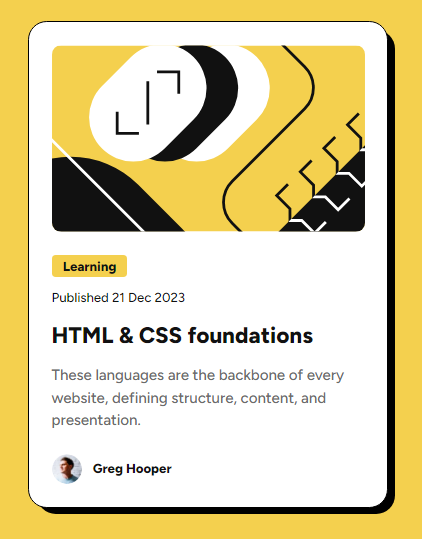
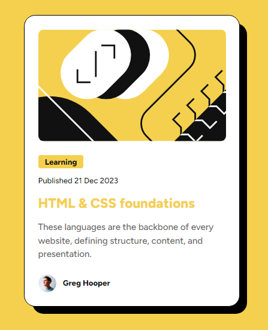

# Frontend Mentor - Blog preview card solution

這是透過 [Blog preview card challenge on Frontend Mentor](https://www.frontendmentor.io/challenges/blog-preview-card-ckPaj01IcS)。 Frontend Mentor 挑戰項目來提高自我編寫程式能力。

## 目錄

- [Frontend Mentor - Blog preview card solution](#frontend-mentor---blog-preview-card-solution)
  - [目錄](#目錄)
  - [概述](#概述)
    - [挑戰項目](#挑戰項目)
    - [截圖](#截圖)
    - [連結](#連結)
  - [我的流程](#我的流程)
    - [建構於](#建構於)
    - [我學到了什麼](#我學到了什麼)

## 概述

### 挑戰項目

用戶端應該能夠:

- 閱覽所有的卡片元素，並且進行懸停和聚焦等互動行為。
- 閱覽具備桌面端及手機端的卡片尺寸項目。

挑戰:
- 卡片需按照設計規範呈現尺寸大小
- 確保懸停畫面時，卡片陰影及標題文字保持一定平滑過度。

### 截圖

卡片樣式預覽。

卡片懸停時應具備樣式。

### 連結

- Solution URL: [Add solution URL here](https://your-solution-url.com)

## 我的流程

### 建構於

- HTML5 建立網頁結構
- CSS3 定義網頁樣式
- Flexbox 排版
- 桌面版優先開發流程

### 我學到了什麼

- **CSS 變數管理**：運用 CSS 變數對固定樣式及字形進行管理，提升了樣式的可維護性和一致性。 
- **偽元素與動畫**：使用 `::before` 和 `::after` 偽元素來創建陰影效果，並通過  `:hover` 添加互動性。 
- **響應式設計**：通過`媒體查詢 @media`調整不同裝置上的字體大小和佈局，確保在各種屏幕上的良好顯示效果。 
